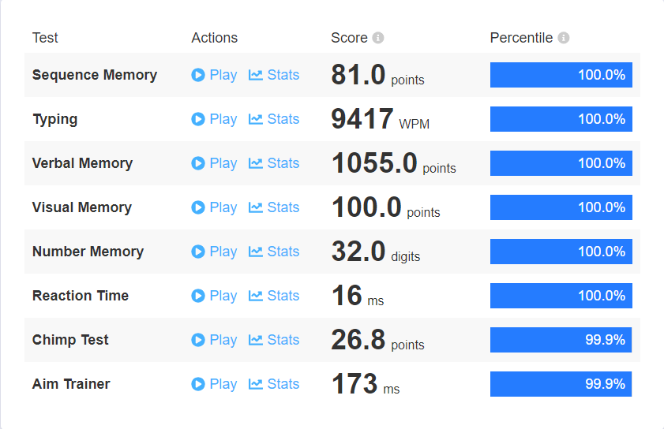

# Human Benchmark Challenge Solver

This repository contains a the Python script I used to automatically solves the Human Benchmark challenges with a 100% Percentileo ve other humans. The program is messy since I created it as my first project to learn python, I'm sure that a lot of the scripts will be patched so contact me if anything is broken.

## Features

- 100% accuracy in all Human Benchmark challenges
- Fast execution time
  
## Results

Here are the results of the challenges solved by the script:

## Contributing

Contributions are welcome! If you have suggestions for improvements or new features, please fork the repository and submit a pull request.
